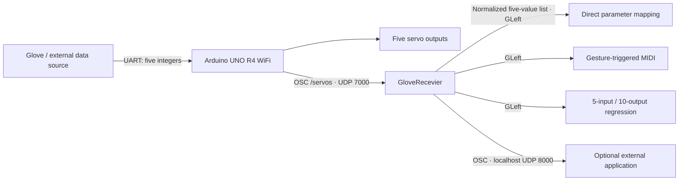

# Glove System — Arduino, OSC & Max for Live

A five-channel glove interface for musical performance in Ableton Live. The system combines Arduino servo control, OSC over Wi-Fi, continuous parameter mapping, gesture-triggered MIDI notes, and a learned mapping from five glove values to ten control outputs.

This repository contains the Arduino bridge firmware, four Max for Live devices, readable Max patch sources, and an example regression model. The firmware receives glove data from an **external serial source**; the glove sensor acquisition firmware and Bluetooth transmitter are outside this release.



## Included modules

| File | Role |
| --- | --- |
| [`arduino/glove/glove.ino`](arduino/glove/glove.ino) | Reads five comma-separated integers from `Serial1`, controls five servos, and sends one `/servos` OSC message per processed frame. |
| [`GloveRecevier.amxd`](max/devices/GloveRecevier.amxd) | Receives UDP port 7000, routes `/servos`, displays values, normalizes each channel to 0–1, and publishes the list on `GLeft`. Also forwards individual channels to localhost port 8000. |
| [`Glove_Direct_Map.amxd`](max/devices/Glove_Direct_Map.amxd) | Five independent parameter mapping rows driven by the normalized glove channels. Stereo audio passes through unchanged. |
| [`Glovebang.amxd`](max/devices/Glovebang.amxd) | Five movement detectors drive MIDI notes, with optional randomized pitch and duration and probabilistic note bursts. |
| [`reressorMapping2.amxd`](max/devices/reressorMapping2.amxd) | Uses a Data Knot regressor to convert the five-channel glove list into ten parameter mapping values. Includes training controls in the patch editor. Stereo audio passes through unchanged. |
| [`gloveRegressor10.json`](max/devices/gloveRegressor10.json) | Example model containing ten paired training examples and a fitted 5 → 3 → 3 → 10 neural network. |
| [`unitPart.maxpat`](max/devices/unitPart.maxpat) | Shared Live parameter assignment row, recovered from the local `brainMapper Project`. Required by both mapping devices. |

Original device filenames, including `Recevier` and `reressor`, are retained for compatibility. The four `.amxd` files are unchanged copies of the supplied devices.

## Requirements

- **Arduino UNO R4 WiFi**, with the Arduino UNO R4 Boards package. The sketch uses `WiFiS3`, `WiFiUdp`, **Servo**, and the **CNMAT OSC** library.
- An external UART source producing the documented frame format at **115200 baud**. A Bluetooth-to-UART receiver is one possible source; this sketch does not use onboard Bluetooth APIs.
- Five servos, a suitable servo power supply, and the mechanical glove assembly. Servo specifications, sensor wiring, and mechanical drawings are not included.
- Ableton Live with Max for Live available. The supplied patches were saved with **Max 9.1.3 / 9.1.5**; this is file metadata, not a tested compatibility guarantee.
- **CNMAT MMJ Depot** for the message-rate `delta` abstraction used by `Glovebang`.
- **Data Knot** and **FluCoMa** for the regression device. These packages are external dependencies and are not bundled.

See [installation and troubleshooting](docs/SETUP.md) for dependency links and configuration details.

## Quick start

1. Install the Arduino board package and libraries. Open `arduino/glove/glove.ino` and replace `YOUR_WIFI_SSID`, `YOUR_WIFI_PASSWORD`, and the example destination IP with your local settings. Keep personal credentials out of public commits.
2. Select **Arduino UNO R4 WiFi** and upload the sketch. Configure the external source for `Serial1` at 115200 baud, with frames such as `0,180,180,180,700;`.
3. Keep everything in `max/devices/` together. Install the Max packages above and make this directory available in Max's file search path if dependencies do not resolve automatically.
4. Put one `GloveRecevier.amxd` on a dedicated audio track. Ensure the Arduino sends to this computer's LAN IPv4 address on UDP **7000**. The receiver displays five incoming values.
5. Add `Glove_Direct_Map.amxd` or `reressorMapping2.amxd` to an audio track for parameter control. Use each row's assignment button to select a Live parameter. Put `Glovebang.amxd` before an instrument on a MIDI track to generate notes.
6. Calibrate channel ranges in the receiver's `p OSCScale` subpatch before evaluating gestures or training a new model.

The receiver is a control device with an audio-effect container; it has no wired audio pass-through. Use a dedicated track for it. The `GLeft` bus is shared across the receiving devices in the same Max environment, so start with one receiver.

## Data interface

| Stage | Format / range |
| --- | --- |
| External source → Arduino | ASCII `v0,v1,v2,v3,v4;`, 115200 baud. Semicolon ends the frame. |
| Arduino → computer | OSC `/servos` with five integer arguments, nominally 0–180, UDP port 7000. Values are calibrated before servo direction reversal. |
| Receiver → mapping modules | `GLeft`: five floats clipped to 0–1, in the original channel order. |
| Receiver → optional external application | Five separate OSC addresses `/glove/finger/0` through `/glove/finger/4`, one normalized float each, to `127.0.0.1:8000`. This branch reverses the channel numbering. |
| Regression → mapping rows | Ten values, displayed and constrained to 0–1 by the output multislider before parameter mapping. |

Exact pin assignments, normalization formulas, channel numbering, gesture logic, and model details are documented in the [technical specification](docs/TECHNICAL.md).

## Repository layout

```text
.
├── README.md
├── arduino/glove/glove.ino        # Sanitized firmware; English comments
├── max/devices/                  # Four original .amxd devices, model, helper
├── max/source/                   # JSON patch sources extracted from .amxd
├── docs/
│   ├── SETUP.md                  # Installation, calibration, troubleshooting
│   ├── TECHNICAL.md              # Protocols, signal flow, algorithms
│   ├── VALIDATION.md             # Checks performed and remaining limitations
│   ├── PUBLISHING.md             # GitHub repository upload instructions
│   └── file-manifest.json        # Device hashes and source metadata
└── tools/audit_release.py        # Offline structural and integrity checks
```

## Verification and release status

The sanitized sketch compiled successfully for UNO R4 WiFi using Arduino UNO R4 Boards **1.6.0**, Servo **1.2.1**, and CNMAT OSC **1.3.7**. The device payloads and model structure were inspected, and the release includes the missing parameter mapping helper. See the [validation record](docs/VALIDATION.md) for reproducible checks.

Hardware movement, network delivery, MIDI output, Live parameter assignment, and saved-set recall have **not been tested in this review**. This release documents the existing implementation, including its parser, connection, and mapping limitations.

## Dependencies and credits

- [Arduino UNO R4 WiFi documentation](https://docs.arduino.cc/tutorials/uno-r4-wifi/cheat-sheet/) — board, UART, and Wi-Fi APIs.
- [CNMAT OSC](https://github.com/CNMAT/OSC) — Arduino OSC encoding.
- [Cycling '74 UDP receive documentation](https://docs.cycling74.com/reference/udpreceive/) and [UDP send documentation](https://docs.cycling74.com/reference/udpsend/) — Max network transport and OSC conversion.
- [CNMAT MMJ Depot](https://github.com/CNMAT/CNMAT-MMJ-Depot) — `delta` abstraction.
- [Data Knot, by Rodrigo Constanzo](https://rodrigoconstanzo.com/data-knot/) and [FluCoMa](https://learn.flucoma.org/reference/mlpregressor/) — regression tools.

No project-wide license has been selected for this release. The supplied files and recovered `unitPart.maxpat` do not establish a redistribution license or complete authorship history. Third-party libraries remain subject to their own terms; this repository does not relicense them.
