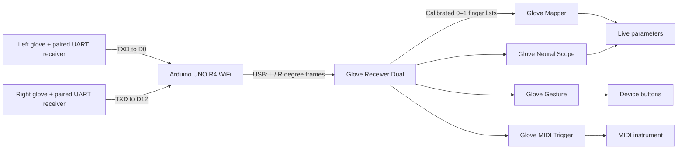

# Glove System

A dual-hand musical control system based on the **ElastremeSense Manu-5D e-skin data glove kit**. Two Bluetooth-to-UART receivers connect to an Arduino UNO R4 WiFi; one USB connection carries both hands into Ableton Live. The Max for Live devices provide calibrated finger data, continuous parameter mapping, learned gesture control and MIDI performance.

## Devices and downloads

| Module | Function | Download | Guide |
| --- | --- | --- | --- |
| Arduino USB · D12 hardware UART | Left D0/D1 and right D12/D11 UART inputs; one tagged USB stream | [Firmware](arduino/glove_usb_dual_hardware/Glove_USB_D12.zip) | [Wiring and upload](arduino/glove_usb_dual_hardware/README.md) |
| Glove Receiver Dual | USB/OSC reception, independent hand calibration, jitter filtering, curl display and OSC forwarding | [Receiver](receiver-v2/Glove_Receiver_Dual.zip) | [Operation](receiver-v2/README.md) |
| Glove Gesture | Left/right/combined-pose classification and gesture-to-button mapping | [Gesture](gesture-classification/Glove%20Gesture.zip) | [Training and mapping](gesture-classification/README.md) |
| Glove Neural Scope | Learn left/right/both-hand poses to parameters of a selected device | [Neural Scope](neural-scope/Glove%20Neural%20Scope.zip) | [Training and models](neural-scope/README.md) |
| Glove Mapper | Ten independent finger-to-parameter mappings with output Min/Max | [Mapper](mapper/Glove_Mapper.zip) | [Mapping](mapper/README.md) |
| Glove MIDI Trigger | Acceleration strikes, curl-held notes, fixed/random scale pitches and velocity ranges | [MIDI Trigger](midi-trigger/Glove_MIDI_Trigger.zip) | [MIDI operation](midi-trigger/README.md) |

## Requirements

- ElastremeSense Manu-5D gloves and paired Bluetooth-to-UART receivers supplying the documented serial format.
- Arduino UNO R4 WiFi, its Arduino board package, and the Servo library. The sketch enables both hardware UART inputs and does not require Wi-Fi configuration.
- Ableton Live with Max for Live; the device files target Max 9.
- **FluidCorpusManipulation / FluCoMa**, installed through Max Package Manager, for Gesture and Neural Scope. These devices use `fluid.mlpclassifier~` and `fluid.mlpregressor~`; their native library is not bundled. The Receiver, Mapper and MIDI Trigger use native Max objects without FluCoMa.

## Start playing

1. Connect the left receiver's **TXD → D0**, the right receiver's **TXD → D12**, and common ground. Follow the [wiring guide](arduino/glove_usb_dual_hardware/README.md) for power, optional return TX connections and servo settings.
2. Upload `arduino/glove_usb_dual_hardware/glove_usb_dual_hardware.ino` with **Arduino UNO R4 WiFi** selected. Close Arduino Serial Monitor afterwards.
3. Extract the device packages. Keep every AMXD with its companion files in the same extracted runtime folder.
4. Load **Glove Receiver Dual** on an audio track. Open **USB…**, Refresh, select the board's port and click Open. Calibrate each hand using **Open → 0** and **Fist → 0.9**.
5. Load **Mapper**, **Gesture** or **Neural Scope** on an audio track or after an instrument. Load **MIDI Trigger before an instrument on a MIDI track**. All receive shared `GLeft` / `GRight` data from the Receiver.

## Documentation

- [Operating guide](docs/OPERATING.md): installation, calibration, device placement, performance and troubleshooting.
- [Technical specification](docs/TECHNICAL.md): wiring, serial/OSC formats, shared buses, signal processing, learning and MIDI behavior.
- Each module includes English and Chinese operating instructions.

[Archived files](https://github.com/lingyuanyangg/glove-system/tree/codex/archive-before-cleanup-2026-10-08-10a403e) are stored separately from the current modules.
