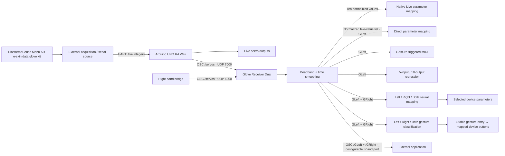

# Glove System — Arduino, OSC & Max for Live

A five-channel glove interface for musical performance in Ableton Live, based on the **ElastremeSense Manu-5D e-skin data glove kit**. The system combines Arduino servo control, OSC over Wi-Fi, continuous parameter mapping, gesture-triggered MIDI notes, and a learned mapping from five glove values to ten control outputs.

This repository contains the Arduino bridge firmware, four original Max for Live devices, a rebuilt dual-hand receiver, glove neural-mapping and gesture-classification devices, readable Max patch sources, and named model selectors. The firmware receives glove data from an **external serial source**; the glove sensor acquisition firmware and Bluetooth transmitter are outside this release.

The new [**Glove Receiver Dual**](receiver-v2/README.md) adds right-hand reception on UDP **6000**, ten native Live mapping controls, two vector hand drawings, adjustable deadband and time smoothing, shared `GLeft` / `GRight` buses, and configurable OSC forwarding to `/GLeft` / `/GRight`. Left-hand reception remains on **7000**. An **OSC / USB** selector now accepts both hands through one Arduino USB serial port at 115200, with port selection and explicit Open/Close controls. The low-latency receiver uses 2ms native polling, read-sized byte batches, latest-per-hand burst handling and an 8ms default filter, with independent monitor drawing. Existing Sets may restore the earlier 30ms Smooth setting; lower it manually. Each hand now captures Open = 0 and Fist = 0.9 calibration with headroom to 1.0; every finger has saved native Mapping Min/Max percentages. Its audio path passes stereo through unchanged. The algorithm and patch structure are verified; operation and mapping recall in Live still require host testing.

The new [**Glove Neural Scope**](neural-scope/README.md) learns Left, Right or Both glove gestures to selected device parameters on its own track or Live's selected track. It combines neural regression with Scope Lab-style target discovery and parameter ranges, a compact Ableton-style gray/orange interface, independent training banks, saved-model selection with JSON import/export, native FluCoMa training/inference, native parameter control and 30 ms output smoothing. [Download the portable device package](neural-scope/Glove%20Neural%20Scope.zip). Its offline checks pass; native Live acceptance is still pending.

[**Glove Gesture**](gesture-classification/README.md) classifies Left, Right or Both hand poses using native FluCoMa `fluid.mlpclassifier~`. The compact main UI shows one selected or detected pose, with training dropdowns for Open, Fist, Index, V, Middle and OK. Both mode selects the left and right poses independently and learns any of 36 ordered combinations. Record your examples and Other/transition poses, Train, then map stable entries to two-state Live device buttons in a separate Mapping window with 48 independent native target slots. Actions include Toggle, Pulse, Hold, On and Off, with temporal/distance filtering and named model import/export. [Download the classification device](gesture-classification/Glove%20Gesture.zip). Native algorithms and offline protocol checks pass; real-glove accuracy and Live integration still require testing.



## Included modules

| File | Role |
| --- | --- |
| [`Glove Gesture.amxd`](gesture-classification/Glove_Gesture/Glove%20Gesture.amxd) | Train six illustrated gestures plus Other using Left/Right/Both input; stable triggers operate native-mapped device buttons. Keep its JS and HTML companions together. |
| [`Glove Neural Scope.amxd`](neural-scope/Glove_Neural_Scope/Glove%20Neural%20Scope.amxd) | Learns 5- or 10-input glove gestures to up to 256 selected-device parameters. Keep its JS, HTML and model companions alongside it. Native Live testing remains pending. |
| [`glove_usb_dual.ino`](arduino/glove_usb_dual/glove_usb_dual.ino) | Optional UNO R4 WiFi dual-UART-to-USB firmware: left D0/D1, right RX D11 / TX D10; tagged L/R angle frames. See its wiring guide before connecting. |
| [`Glove_Receiver_Dual.amxd`](receiver-v2/Glove_Receiver_Dual.amxd) | New dual-hand audio effect: left 7000, right 6000; ten 0–1 displays and native mappings; jitter filtering; Max buses and optional OSC output. Keep its three companion JavaScript files alongside it. |
| [`arduino/glove/glove.ino`](arduino/glove/glove.ino) | Reads five comma-separated integers from `Serial1`, controls five servos, and sends one `/servos` OSC message per processed frame. |
| [`GloveRecevier.amxd`](max/devices/GloveRecevier.amxd) | Receives UDP port 7000, routes `/servos`, displays values, normalizes each channel to 0–1, and publishes the list on `GLeft`. Also forwards individual channels to localhost port 8000. |
| [`Glove_Direct_Map.amxd`](max/devices/Glove_Direct_Map.amxd) | Five independent parameter mapping rows driven by the normalized glove channels. Stereo audio passes through unchanged. |
| [`Glovebang.amxd`](max/devices/Glovebang.amxd) | Five movement detectors drive MIDI notes, with optional randomized pitch and duration and probabilistic note bursts. |
| [`reressorMapping2.amxd`](max/devices/reressorMapping2.amxd) | Uses a Data Knot regressor to convert the five-channel glove list into ten parameter mapping values. Includes training controls in the patch editor. Stereo audio passes through unchanged. |
| [`unitPart.maxpat`](max/devices/unitPart.maxpat) | Shared Live parameter assignment row, recovered from the local `brainMapper Project`. Required by both mapping devices. |

Original device filenames, including `Recevier` and `reressor`, are retained for compatibility. The four `.amxd` files are unchanged copies of the supplied devices.

## Requirements

- **ElastremeSense Manu-5D e-skin data glove kit** — the glove hardware used as the basis of this project. Its acquisition and transmission setup supplies the external data source for the Arduino bridge; that source must output the serial frame format documented below.
- **Arduino UNO R4 WiFi**, with the Arduino UNO R4 Boards package. The sketch uses `WiFiS3`, `WiFiUdp`, **Servo**, and the **CNMAT OSC** library.
- An external UART source producing the documented frame format at **115200 baud**. A Bluetooth-to-UART receiver is one possible source; this sketch does not use onboard Bluetooth APIs.
- Five servos, a suitable servo power supply, and the mechanical glove assembly. Servo specifications, sensor wiring, and mechanical drawings are not included.
- Ableton Live with Max for Live available. The supplied patches were saved with **Max 9.1.3 / 9.1.5**; this is file metadata, not a tested compatibility guarantee.
- **CNMAT MMJ Depot** for the message-rate `delta` abstraction used by `Glovebang`.
- **Data Knot** and **FluCoMa** for the original `reressorMapping2` regression device. These packages are external dependencies and are not bundled. Glove Neural Scope and Glove Gesture use **FluCoMa / FluidCorpusManipulation 1.0.9**, the version checked locally, while Data Knot is optional for these new devices.

See [installation and troubleshooting](docs/SETUP.md) for dependency links and configuration details.

## Quick start

1. Install the Arduino UNO R4 board package and Servo library. Choose Wi-Fi (`arduino/glove/glove.ino`) or USB (`arduino/glove_usb_dual/glove_usb_dual.ino`). For Wi-Fi only, replace the credential/IP placeholders with local settings; keep credentials out of public commits.
2. Select **Arduino UNO R4 WiFi** and upload the chosen sketch. Both use 115200 baud input. USB uses the supplied complete 11-field glove format; Wi-Fi retains the original parser. Follow the selected sketch's wiring guide.
3. For USB instead of Wi-Fi, upload `arduino/glove_usb_dual/glove_usb_dual.ino`, use its wiring guide, and connect the board by USB. In the Dual receiver open USB… settings, click Refresh, select the USB port, then Open. Close other serial programs first.
4. Keep `receiver-v2/Glove_Receiver_Dual.amxd` and its three JavaScript files together. Drag the AMXD onto an audio track. This new receiver needs only native Max for Live objects.
5. For OSC input, ensure the left Arduino sends to this computer's LAN IPv4 address on UDP **7000**. Configure the right-hand bridge to send to **6000**. Each hand sends `/servos` with five arguments; finger order is pinky, ring, middle, index, thumb.
6. Click a finger's **Map** control, then click a Live parameter. Adjust **Smooth** and **Deadband** to suppress sensor jitter. Configure output **IP** and **Port**, click **Apply**, and enable **OSC Out** if forwarding is needed.
7. For the new neural mapper, unpack `neural-scope/Glove Neural Scope.zip` and keep all runtime companions together. Install FluCoMa / FluidCorpusManipulation 1.0.9 or later in Max Package Manager. Load the effect after an instrument or on an audio track. Choose Left/Right/Both, select a target and scope, Capture distinct poses with their target sound, Train, then Run. Stop releases all mappings. Enter a model name and Save to keep a snapshot in MODEL; Load recalls it, and Import/Export transfers JSON files between Sets. No default regression JSON is bundled. See the [guide](neural-scope/README.md).
8. For classification, unpack `gesture-classification/Glove Gesture.zip` and keep its companions together. Choose Left/Right/Both, record each enabled gesture and Other several times, Train, then test Run before mapping. Open Mapping and click a gesture or combination's Map and a two-state device parameter button; choose Toggle/Pulse/Hold/On/Off. See the [classification guide](gesture-classification/README.md).
9. For gesture notes or original regression, keep `max/devices/` together and install the relevant packages above. `Glovebang` and `reressorMapping2` consume the filtered left-hand `GLeft` list. Verify calibration before evaluating gestures or training a model.

The legacy `GloveRecevier` has no wired audio pass-through; use a dedicated track if choosing that version. The new Dual receiver passes stereo audio through. `GLeft` and `GRight` are shared across the Max environment, so use one receiver per set and avoid binding two devices to the same UDP port. See the [Dual receiver guide](receiver-v2/README.md) for filtering, input validation and output behavior.

## Data interface

| Stage | Format / range |
| --- | --- |
| External source → Arduino | ASCII `v0,v1,v2,v3,v4;`, 115200 baud. Semicolon ends the frame. |
| Arduino → computer | OSC `/servos` with five integer arguments, nominally 0–180, UDP port 7000. Values are calibrated before servo direction reversal. |
| Receiver → mapping modules | `GLeft`: five floats clipped to 0–1, in the original channel order. |
| Dual receiver → Max / external application | `GLeft` and `GRight` each carry five filtered floats. Optional OSC `/GLeft` and `/GRight` carry the same lists to a configured destination. |
| Legacy receiver → optional external application | Five separate OSC addresses `/glove/finger/0` through `/glove/finger/4`, one normalized float each, to `127.0.0.1:8000`. This branch reverses the channel numbering. |
| Regression → mapping rows | Ten values, displayed and constrained to 0–1 by the output multislider before parameter mapping. |

Exact pin assignments, normalization formulas, channel numbering, gesture logic, and model details are documented in the [technical specification](docs/TECHNICAL.md).

## Repository layout

```text
.
├── README.md
├── arduino/glove/glove.ino        # Sanitized firmware; English comments
├── max/devices/                  # Four original .amxd devices and helper
├── max/source/                   # JSON patch sources extracted from .amxd
├── receiver-v2/                  # Dual receiver, companion JS, source and checks
├── neural-scope/                 # Neural mapper, portable ZIP, guides, source and checks
├── docs/
│   ├── SETUP.md                  # Installation, calibration, troubleshooting
│   ├── TECHNICAL.md              # Protocols, signal flow, algorithms
│   ├── VALIDATION.md             # Checks performed and remaining limitations
│   ├── PUBLISHING.md             # GitHub repository upload instructions
│   └── file-manifest.json        # Device hashes and source metadata
└── tools/audit_release.py        # Offline structural and integrity checks
```

## Verification and release status

The sanitized sketch compiled successfully for UNO R4 WiFi using Arduino UNO R4 Boards **1.6.0**, Servo **1.2.1**, and CNMAT OSC **1.3.7**. The device payloads were inspected; the former model was reviewed before its requested removal, and the release includes the missing parameter mapping helper. See the [validation record](docs/VALIDATION.md) for reproducible checks.

Hardware movement, network delivery, MIDI output, Live parameter assignment, and saved-set recall have **not been tested in this review**. The new receiver passes fifteen engine checks, 35 simulated USB/controller and native input graph checks and recursive patch, mapping, envelope and layout checks; see its [validation record](receiver-v2/VALIDATION.md). Glove Neural Scope also passes standalone native FluCoMa core, simulated host/native-message protocol, model format, UI transport/theme and patch checks; see its [validation record](neural-scope/VALIDATION.md). The original implementation's parser, connection and mapping limitations remain documented separately.

Glove Gesture passes synthetic native classification, controller/protocol, temporal/model, UI-function and patch checks. Its six SVG illustrations were rasterized and visually inspected. See the [classification validation record](gesture-classification/VALIDATION.md); these checks do not establish real-glove recognition accuracy or actual Live button behavior.

## Dependencies and credits

- **ElastremeSense Manu-5D e-skin data glove kit** — glove hardware platform used in this project.
- [Arduino UNO R4 WiFi documentation](https://docs.arduino.cc/tutorials/uno-r4-wifi/cheat-sheet/) — board, UART, and Wi-Fi APIs.
- [CNMAT OSC](https://github.com/CNMAT/OSC) — Arduino OSC encoding.
- [Cycling '74 UDP receive documentation](https://docs.cycling74.com/reference/udpreceive/) and [UDP send documentation](https://docs.cycling74.com/reference/udpsend/) — Max network transport and OSC conversion.
- [CNMAT MMJ Depot](https://github.com/CNMAT/CNMAT-MMJ-Depot) — `delta` abstraction.
- [Data Knot, by Rodrigo Constanzo](https://rodrigoconstanzo.com/data-knot/) and [FluCoMa](https://learn.flucoma.org/reference/mlpregressor/) — regression tools.

No project-wide license has been selected for this release. The supplied files and recovered `unitPart.maxpat` do not establish a redistribution license or complete authorship history. Third-party libraries remain subject to their own terms; this repository does not relicense them.
