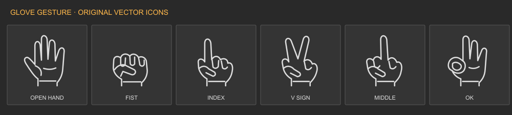

# Glove Gesture

A FluCoMa-based Max for Live classifier for **Left**, **Right** or **Both** hand poses. The **800 × 169** main UI shows the selected training pose, then the detected pose during Run. A separate Mapping window assigns gestures to device buttons. Stereo audio passes through.

[Download Gesture](Glove%20Gesture.zip) · [中文操作说明](README_中文.md)

## Install

Install **FluidCorpusManipulation / FluCoMa** in Max Package Manager. Keep all files in `Glove_Gesture` together, including the AMXD, controller, both UI HTML files, help HTML and help-path JavaScript. Load on an audio track or after an instrument. Connect and calibrate [Glove Receiver Dual](../receiver-v2/README.md) first; this device reads `GLeft` / `GRight` and does not open another USB port or UDP socket.

## Train one hand

1. Select **Left hand** or **Right hand**.
2. Choose **Open hand, Fist, Index, V sign, Middle or OK** from the training menu. The pose drawing follows the selection.
3. Click **Record 2s** while holding the pose. Repeat several times with natural variations. Recorded classes become enabled; **Include in training** can exclude one, and Clear removes that class's examples.
4. Record relaxed poses and transitions using **Other 2s**. Every enabled class and Other require at least 20 examples. Unrecorded classes need not be included.
5. Click **Train**, then **Run**. The picture follows the detected gesture. Confirming waits for stability; Confirmed is the active gesture; Other means no accepted known pose.

Keep calibration/filter settings consistent. Test new repetitions and transitions before assigning performance actions. Finger-bend measurements cannot distinguish thumb/index contact, orientation or position if the measured patterns are identical.

## Train a combined pose

Choose **Both hands** and select the left and right gestures independently, for example **Left Fist + Right V sign**. Record 2s captures Left's five values followed by Right's five as one class, `fist__v`. Record the other pairs you need, record Other, then Train.

There are **36 ordered combinations**: `fist__v` and `v__fist` are distinct. Both is one ten-input classifier for a complete paired pose. Only enabled recorded pairs participate. Each hand's input expires after 300 ms and Both requires arrival times within 80 ms. Keep both gloves connected during recording and Run.

## Map device buttons

Open **Mapping** and select the assignment view. Left has six slots, Right six, Both 36. The Mapping view selector does not change the classifier's active input mode. **Show all combinations** exposes every Both pair; the default view lists recorded/enabled/mapped pairs.

Click a row's **Map**, then a two-state exposed device parameter in Live, such as Device On/Off or an effect switch. **×** clears it. Non-quantized 0–1 switches are accepted; other continuous ranges and multi-state enums are not. Transport, track arm/mute/solo, clip launch and arbitrary UI buttons are outside this mapping interface.

| Action | Result |
| --- | --- |
| Toggle | Invert the target once on stable gesture entry |
| Pulse | High, then low after Pulse ms |
| Hold | High while confirmed; low on exit, Stop or input loss |
| On / Off | Write the requested state once; retain it after exit |

Holding one pose does not repeatedly fire. Exit into Other or another confirmed pose before re-entering. Pulse/Hold release to low, not the previous state. A later action on a shared target supersedes its temporary release.

## Timing and saved models

Defaults are **Hold 120 ms**, **Gap 350 ms**, **Pulse 120 ms**, **Radius 0.18** and **500 epochs**. Hold requires a stable pose; Gap limits successive triggers. Radius is normalized RMS distance to the predicted class's nearest stored example, not a probability. Training error measures recorded examples, not recognition accuracy on new poses.

Enter a model name and Save. Select a snapshot and Load in its matching hand mode; Run stays off. Export/Import transfers model JSON with examples, labels and weights, without Live button assignments. Save the Live Set to retain the three input banks, models, settings and native mappings.

## Max events

`GGestureLeft`, `GGestureRight` and `GGestureBoth` emit `enter <label> <number>` / `exit <label> <number>`. Single-hand numbers are Open 1, Fist 2, Index 3, V 4, Middle 5, OK 6. Both labels are `left__right`; number = `1 + leftIndex * 6 + rightIndex` with zero-based indices in that order. Fist + V is `fist__v` 10. Other is quiet; Stop/loss exits an active class.

See the [technical specification](../docs/TECHNICAL.md) for networks, limits and processing, and [operating guide](../docs/OPERATING.md) for setup/troubleshooting.
