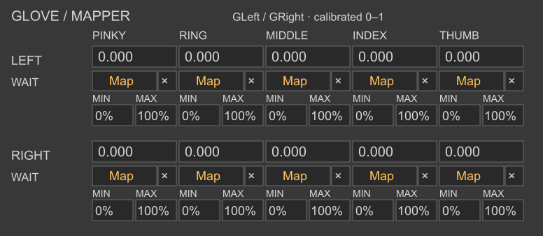

# Glove Mapper

A Max for Live audio effect with ten independent finger-to-parameter mappings, in a **388 × 169** native Live interface. Each finger has a 0–1 monitor, Map, ×, Min and Max. Stereo audio passes through.

[Download Mapper](Glove_Mapper.zip) · [中文操作说明](README_中文.md)

## Operation

1. Keep `Glove_Mapper.amxd` and `glove_mapper.js` together. Load on an audio track or after an instrument.
2. Connect and calibrate [Glove Receiver Dual](../receiver-v2/README.md) in the same Set. Both hands use pinky, ring, middle, index, thumb order.
3. Click a finger's **Map**, then click the target Live parameter. **×** releases its assignment.
4. Set **Min / Max** as percentages of the target's native range. Default 0/100 uses the full range; reversed endpoints invert the response and equal endpoints produce a fixed value.
5. Save the Live Set to retain assignments and ranges. Keep Live's audio engine enabled for parameter control.

With Min 20%, Max 80%, curl 0 reaches 20%, calibrated fist 0.9 reaches 74%, and curl 1 reaches 80%. Values are normalized by the Receiver before mapping; the Mapper adds no second smoothing stage.

## Inputs and status

`GLeft` / `GRight` supply physical filtered frames and freshness. `GLeftControl` / `GRightControl` supply changes between physical frames while smoothing converges. Monitors refresh around 30 Hz independently of the control signal.

WAIT means no valid physical frame since load, LIVE means recent valid input, and HOLD means over one second without it. HOLD retains the last value and assignment; it is not a Bluetooth pairing status. Calibration/filter settings belong to the Receiver. Shared Max buses allow the Mapper and Receiver to be on different tracks.

See the [technical specification](../docs/TECHNICAL.md) for target scaling and [operating guide](../docs/OPERATING.md) for setup.
