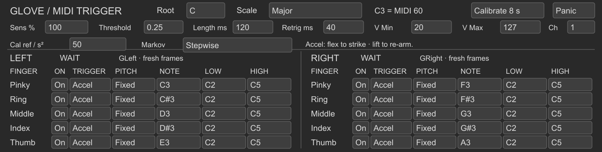

# Glove MIDI Trigger

A native Max for Live **MIDI effect** for ten independent fingers: bend-acceleration strikes or curl-held notes, fixed or scale-constrained random pitches, and individual note/velocity ranges. The **984 × 169** main panel places both hands' settings side by side.

[Download MIDI Trigger](Glove_MIDI_Trigger.zip) · [中文操作说明](README_中文.md)

## Install and play

Keep `Glove_MIDI_Trigger.amxd` and `glove_midi_trigger.js` together. Load on a **MIDI track before an instrument**. Connect/calibrate [Glove Receiver Dual](../receiver-v2/README.md) anywhere in the same Set. The effect reads fresh `GLeft` / `GRight` frames, ordered pinky, ring, middle, index, thumb. Keyboard/clip MIDI passes through.

Return fingers to an open pose. LEFT/RIGHT show LIVE when data arrive and WAIT otherwise. A star beside a finger means it owns an active note.

## Per-finger controls

| Control | Function |
| --- | --- |
| On | Enable/disable; disabling releases its note |
| Trigger | Accel = short movement strike; Toggle = note held while curled |
| Pitch / Note | Fixed uses Note; Random chooses once at each trigger |
| Root / Scale | Random only: root C–B, chromatic, major/minor, diatonic modes, pentatonic, blues or whole tone |
| Low / High | Inclusive random MIDI note range, 0–127; only notes within the selected scale are eligible |
| V Min / V Max | Per-finger MIDI velocity endpoints, 1–127; reversed endpoints invert response |

Fixed mode ignores Root/Scale/Low/High; Random ignores Note. An empty random scale/range intersection produces no note and a message. Live uses its own octave names, such as C3 for MIDI 60. Default fixed notes are MIDI 60–69 across Left pinky through Right thumb.

## Acceleration and global calibration

Accel uses the magnitude of **bend acceleration**, calculated from normalized curl changes over time. It is not IMU acceleration. Starting/stopping either bend or extension can strike a note. Stronger movement produces larger velocity within V Min–V Max.

Click **Calibrate 8 s** and make several representative strikes with enabled fingers. Notes pause while capturing a global reference pooled from both hands. The completed reference is saved as **Cal ref / s²**. Insufficient motion keeps the existing value; click again to cancel.

- **Sens %**: higher makes the same movement stronger/more sensitive.
- **Threshold**: minimum normalized strength to trigger.
- **Length ms**: acceleration-note duration.
- **Retrig ms**: shortest repeat interval per finger.
- **Channel**: outgoing glove MIDI channel, subject to Live/instrument routing.
- **Panic**: release generated notes and return to neutral for re-arm.

Calibration/filter settings in the Receiver affect this signal. Save the Live Set for MIDI settings and calibration; held notes are not recalled.

## Toggle and continuous intensity

Toggle here is a curl gate: **above 0.5 begins a held note; below 0.45 releases it**. Hysteresis avoids threshold chatter. A finger already bent at load/re-enable/reconnect must return below 0.45 first.

Curl 0.5–1 maps to V Min–V Max. Note-on velocity is set at onset; continued curl sends **Poly Aftertouch** at most every 25 ms when its value changes. The instrument must respond to poly pressure for continuous intensity changes. The effect does not repeatedly retrigger a held note. Random chooses once per onset and keeps the pitch during the hold.

Fingers with identical generated pitch/channel share one voice: the first onset supplies velocity, maximum owner intensity supplies pressure, and the last owner releases it. Use distinct pitches for independent articulation. Avoid keyboard/glove overlap on the same pitch if independent note release is needed.

A frame gap over 100 ms resets/release on the next frame; no valid data for 250 ms releases that hand. Disable, settings/mode changes, Panic, calibration and deletion release generated notes. Panic does not send a global All Notes Off for incoming keyboard notes.

See the [technical specification](../docs/TECHNICAL.md) for formulas and timing, and [operating guide](../docs/OPERATING.md) for setup/troubleshooting.
