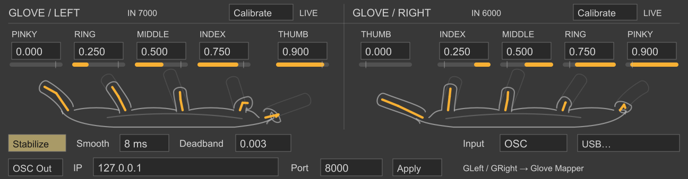
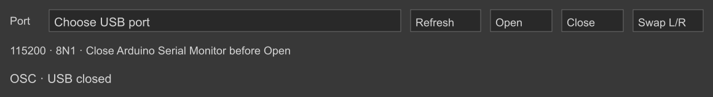
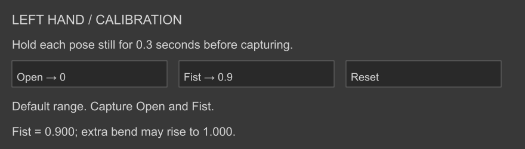

# Glove Receiver Dual

A compact, dual-hand Max for Live audio effect based on the original `GloveRecevier` and the **ElastremeSense Manu-5D e-skin data glove kit** project. It receives both hands over USB or OSC, captures independent open/fist calibration, filters finger jitter, displays animated finger curl, and forwards normalized OSC frames. Native Map/Min/Max now live in the separate [Glove Mapper](../mapper/README.md). The original normalization is retained as the fallback before calibration.

[Download the receiver and USB firmware](Glove_Receiver_Dual.zip).

## Install

Keep `Glove_Receiver_Dual.amxd`, `glove_dual_engine.js`, `glove_hands.js` and `glove_usb_serial.js` **in the same folder**. Drag the AMXD onto an audio track in Ableton Live. The device passes stereo audio through unchanged. This source release uses companion JavaScript files; do not move only the AMXD. Max 9 / a Live edition supporting Max for Live is the target environment.

The original receiver is retained in `../max/devices/GloveRecevier.amxd`. Remove or disable other receivers that bind UDP 7000 or 6000, and use one Dual receiver per set: the Max buses are intentionally shared.

## USB input

The **Input** menu selects **OSC** or **USB**. OSC is the initial mode. USB uses one Arduino connection carrying both hands at **115200, 8N1**; it does not require Wi-Fi.

1. Upload the [dual USB firmware](../arduino/glove_usb_dual/glove_usb_dual.ino) to UNO R4 WiFi. Left module TXD goes to D0; Right module TXD must go to **D11**, with optional TX back to the module on D10. Supply the provided receivers with 3.3V and match signal levels. See the [wiring guide](../arduino/glove_usb_dual/README_中文.md).
2. Close Arduino Serial Monitor and any other program using the same port. Click **USB…** to open the settings window. Click **Refresh**, select the actual USB port, then **Open**. Open also switches Input to USB. The device displays USB activity as L, R or L / R after valid frames arrive. A port selection alone does not open it.
3. Use **Close** before uploading firmware or giving another program the port. Returning Input to OSC closes USB and re-enables the two OSC paths. Both UDP sockets remain allocated, so another receiver must still avoid binding 7000/6000.

```text
L,180.0,160.0,150.0,149.0,134.5;
R,170.0,152.0,149.4,158.0,132.1;
```

These are five **degree values**, already divided by ten in the firmware; this receiver does not divide them again. L/R routes to the same raw calibration and filtering as /servos. The format requires the hand tag, exactly five finite values from 0 to 180, and a semicolon; CR/LF after the terminator is accepted. Partial, oversized, binary and malformed frames are rejected. On Open the first incomplete fragment is discarded until a delimiter or newline. The firmware status `#ERROR,RIGHT_SERIAL_INIT;` is displayed as a Right initialization error, not parsed as finger values.

Port enumeration, Open/Close and 2ms polling use Max's native `serial` object; no Node process, Python bridge, driver installer or serial package is bundled. A driver may be needed if the operating system does not expose the board's port. The saved Live Set retains **the port name**, not its menu index. Port recall and device load always start closed; click Open after confirming the device. A waiting-data status is not proof of successful Bluetooth pairing or an open physical port. The corrected USB firmware sends a one-second board diagnostic packet. While waiting, **board OK** confirms a recent status packet and displays UART byte/valid-frame counters for each hand; **board status stale** means no recent status packet. Diagnostic packets never refresh GLeft/GRight or drive mappings. Zero bytes versus incoming bytes without valid hand frames are distinguished in the USB status.

The compact native main UI stays **648 × 169**, within Live's fixed device height. Input selects OSC or USB; **USB…** opens a separate **580 × 80** native settings window for Port, Refresh, Open, Close and status. See [Cycling ’74's device UI guide](https://docs.cycling74.com/userguide/m4l/live_userinterfaces/). Keep one receiver per Set because the GLeft/GRight buses are shared.

## OSC input and finger order

| Hand | UDP port | Raw OSC address | Normalized OSC address | Max bus / output OSC address |
| --- | ---: | --- | --- | --- |
| Left | 7000 | `/servos` | `/GLeft` | `GLeft` / `/GLeft` |
| Right | 6000 | `/servos` | `/GRight` | `GRight` / `/GRight` |

Each message must contain exactly **five numeric arguments**, in the original project's order: **pinky, ring, middle, index, thumb**. Both receivers reject incomplete or nonnumeric packets. Before explicit pose calibration, normalized input is clipped to 0–1 and raw input uses:

```text
minimum = [0, 18, 18, 18, 70]
maximum = [180, 180, 180, 180, 180]
value[i] = clamp((raw[i] - minimum[i]) / (maximum[i] - minimum[i]), 0, 1)
```

The right hand initially uses the same fallback range. Verify its physical sensor order and ranges. The supplied Arduino sender targets 7000; configure a second sender to target **6000** for the right hand. This device does not add acquisition firmware for the kit.

## Open / fist calibration

Each hand has its own **Calibrate** button and native **440 × 222** settings window. Its read-only inspection table shows all five **Input** values before receiver calibration or filtering, plus the captured Open/Fist endpoints. USB input is in degrees, already divided by ten by Arduino. A **fresh / stale** label describes arrival at Max, not the original Bluetooth sample time. The table refreshes at up to 5Hz independently of control. Before calibration, a normalized thumb value near 0.3 can simply mean an input angle near 103° under the fallback `(angle - 70) / 110`; it does not establish sensor error.

Connect the gloves first, then calibrate each hand independently:

1. Open the hand naturally. Hold it still for at least **0.3 seconds**, then click **Open → 0**.
2. Make a comfortable fist. Hold it still for at least **0.3 seconds**, then click **Fist → 0.9**. Both captures must succeed. The window reports the active calibration.
3. The displayed values, mappings, `GLeft` / `GRight` and forwarded OSC now use the calibrated values. Further bending may raise a finger from **0.900 to 1.000**; values are clipped to 0–1.

```text
value[i] = clamp(0.9 * (input[i] - open[i]) / (fist[i] - open[i]), 0, 1)
```

Endpoints are independent for all five fingers and may run in either sensor direction. Reaching 1.0 requires about 11.1% more sensor travel beyond the captured fist. Calibration cannot create additional hardware travel if the sensor already saturates at the fist pose.

The capture averages valid, unfiltered input from the last **250ms**, with at least three frames and the latest no older than 150ms. A moving pose is rejected when any finger's sample spread exceeds 3 degrees for raw input or 0.02 for normalized input. Every finger needs an absolute open/fist span of at least 5 degrees or 0.025 respectively. Follow the status message and retry the rejected pose; a failed capture leaves the previous complete calibration active. Recalibration requires two new captures. Either pose may be captured first. Partial captures are discarded on stream reset or raw/normalized format changes.

Raw USB and raw `/servos` use degree endpoints. Explicit calibration of normalized `/GLeft` or `/GRight` instead uses normalized endpoints; a pair is applied only to its recorded input format. A raw pair therefore does not renormalize already-normalized OSC. Changing between formats retains the active pair but uses the fallback for the other format. **Reset** restores the default range for that hand only.

Completed pairs are stored through a bound `pattr` Live parameter with the Set. Temporary captures, sample history and stream state are not saved. A calibration change invalidates held data; the next real frame initializes immediately without replaying old samples into learning buses. Only button capture uses averaging, so ordinary control retains the existing low-latency filter. See [Cycling '74's JavaScript state interface](https://docs.cycling74.com/userguide/javascript/).

Calibrate before recording regression or classification examples. If a saved model was trained with different calibration, retrain it using the new input scale. A recorded fist is **0.9**, so existing rules that require a value of exactly 1.0 may need adjustment.

## Interface and independent Mapper

The Receiver has no embedded mapping components or `live.remote~` objects. Its native Live presentation is **648 × 169**, reduced from 808 pixels wide. Each hand shows five read-only **0.000–1.000** values above individual curl meters. The meters have a 0.9 calibrated-fist mark. Mirrored vector hands shorten and fold each finger with its normalized curl; faint open outlines provide a reference. These are an illustrative curl view, not a measured joint-angle reconstruction. Number/hand drawing remains limited to approximately 30Hz.

Filter/Input/USB settings occupy the first bottom row; OSC destination/output occupies the second. Independent Calibrate and USB windows retain their controls and dimensions.

Load [**Glove Mapper**](../mapper/README.md) for ten native Map/Min/Max assignments. It listens to `GLeft` / `GRight` and the Receiver's change-driven `GLeftControl` / `GRightControl` side buses. Signals update without waiting for monitor drawing. The learning buses continue to represent fresh physical input only.

Existing Receiver assignments do not automatically transfer to a new separate device; reassign them in Mapper. Previous installed files have been backed up. A loaded old Set keeps its embedded old patch until replaced. Review/re-enter input, destination and calibration settings when replacing the instance; matching parameter names are retained, but replacement-state migration has not been verified in Live.

**WAIT** means no data has arrived; **LIVE** means valid incoming data; **HOLD** means no valid packet for one second. HOLD retains the last values.

## Jitter suppression

**Stabilize** enables two independent stages for every finger:

1. **Deadband**: ignore changes smaller than the threshold relative to the last accepted input. Default **0.003** on the 0–1 scale. Larger movement accumulates until it exceeds the threshold; it is not compared against the moving filter output.
2. **Smooth**: a time-aware exponential filter, default **8 ms**, evaluated by a nominal 5 ms Max Task. `alpha = 1 - exp(-elapsed_ms / Smooth_ms)`. After one time constant, a step reaches approximately 63%; after three, approximately 95%. Scheduler delay is accounted for, but real-time delivery depends on Max/Live load.

The first valid frame initializes immediately. Smooth = 0 bypasses time smoothing while retaining deadband. Stabilize off bypasses both stages. Deadband = 0 accepts every change. Recommended tuning: increase the deadband when single raw servo steps remain visible; increase smoothing for steadier control, or reduce it for a faster response.

The filtered frame is the single source for the display, independent Mapper, `send GLeft` / `send GRight`, and OSC forwarding. Every frame has five values from the same processing tick. Mapping and OSC outputs remain change-driven on control outlets 0/1. Number displays and hand drawing use separate monitor outlets 5/6, limited to approximately 30 refreshes/second, always showing the latest filtered value; this limit does not gate the native mappings or learning buses. The GLeft/GRight buses also deliver the filtered frame whenever new valid physical data arrives, even if the pose is stationary. Both buses are emitted from the same filter tick when both hands have pending input. This keeps regression/classification consumers fresh while holding a pose; no new input means no synthetic bus heartbeat. Multiple input frames arriving within one tick coalesce to the latest state. Pending frames older than 100ms at the filter tick do not refresh consumers. A one-off software packet is therefore suitable for display testing, but sustained training/Run needs a real stream.

## OSC forwarding

Enter the destination **IP** or host name, set **Port** (default 8000), and click **Apply**. Pressing Return in the IP field also applies it. Enable **OSC Out** to forward one five-argument OSC message per changed hand:

```text
/GLeft  0.1 0.2 0.3 0.4 0.5
/GRight 0.5 0.4 0.3 0.2 0.1
```

Max's `udpsend` encodes these as OSC rather than plain text. OSC forwarding is off initially; enabling it or applying a destination re-sends any current hand frames. IP uses bound `pattr` state, and the port and filter settings use native Live parameter state. Keep the destination separate from the device's own input ports to avoid an OSC feedback loop.

Official object references: [live.map](https://docs.cycling74.com/reference/live.map/), [live.remote~](https://docs.cycling74.com/reference/live.remote~/), [udpreceive](https://docs.cycling74.com/reference/udpreceive/), [udpsend](https://docs.cycling74.com/reference/udpsend/), [serial](https://docs.cycling74.com/reference/serial/), and [live.numbox](https://docs.cycling74.com/reference/live.numbox/).

## Source and rebuild

`Glove_Receiver_Dual.maxpat` is the editable source. The AMXD contains the same patcher payload. No mapping subpatcher, `unitPart` or CNMAT decoder is required by this Receiver. The separate Mapper embeds its native mapping modules.

```sh
python3 tools/build.py
node tools/test_engine.js
node tools/test_usb.js
python3 tools/test_patch.py
```

The Receiver builder uses native Max objects only. The hand drawing is original animated vector JavaScript. See `VALIDATION.md` for the actual verification performed and host limitations.

## Layout previews

Illustrative layout previews generated from the shipped vectors and presentation rectangles; these are not Live screenshots.







## USB troubleshooting correction

Re-upload the corrected USB firmware from this release: the earlier UNO R4 WiFi sender incorrectly gated writes on availableForWrite(), which returns zero for that core's bridge UART. The receiver's USB… opener also now accepts the native live.text bang output. After updating, reload the receiver, open USB… settings, Refresh, choose the current Arduino port and Open. Check the UART counters before changing calibration or filtering.

## Low-latency receiver revision

- Native serial uses background reading (`asyncread 1`) and nominal 2ms polling. Each `read N` status configures a native `zl group` for exactly N bytes; zero-byte polls stay outside JavaScript. Native byte output is not deferred one byte at a time. Complete groups and port status messages enter `deferlow` in FIFO order before the JavaScript controller. Grouping has no fixed fill threshold across polls and retains partial text frames across reads.
- The controller parses every byte for validation and resynchronization but forwards only the latest complete valid frame per hand within each read. A Right fault cancels an earlier Right frame in the same read. Coalescing eliminates redundant intermediate target updates during buffered bursts; it does not establish the hardware capture age of a packet.
- Filtering runs at a nominal 5ms interval. The new Smooth default is 8ms, while Deadband remains 0.003. Under the offline model, a step reaches 95% at the 25ms tick, compared with 90ms for the previous 30ms time constant with 10ms ticks. These numbers describe the filter only, not measured glove-to-Live latency.
- Live mappings and fresh GLeft/GRight streams do not wait for the approximately 30Hz number/hand monitor redraw. First valid values still initialize immediately. With Smooth = 0, values update immediately on accepted input while deadband remains active.

Reload the updated AMXD, open USB… settings and reopen the selected port. **An existing Set may restore Smooth = 30ms; change it to 8ms (or 0ms for minimum filter delay) manually.** Existing Receiver settings names are retained; mapping persistence now belongs to the standalone Mapper. This receiver-only revision does not require re-uploading the already-working corrected USB firmware, and it does not change glove Bluetooth or Arduino frame rates. The supplied firmware caps output at 50 frames/second per hand; host scheduling, audio buffering and Bluetooth transport still contribute latency.

Official behavior: [serial read counts, background reading and polling](https://docs.cycling74.com/reference/serial/), [zl.group](https://docs.cycling74.com/reference/zl.group/), [FIFO deferral](https://docs.cycling74.com/reference/deferlow/), and [JavaScript thread priority](https://docs.cycling74.com/userguide/javascript/).


## Input routing and Right latency

**USB… → Swap L/R** exchanges the two physical input slots before calibration/filtering. It affects monitors, maps, GLeft/GRight, OSC and physical-source loss together. The toggle is saved with the Set and defaults off. Calibration endpoints stay with their physical input slots; mapping targets stay with the logical hand. Input labels follow the selected routing. UART counters remain in physical slot L/R order.

The shared Max filter settings and ticks are the same for both hands. The main Arduino input difference is Serial1 hardware for Left versus SoftwareSerial for Right. Updated software-input firmware drains bounded current queues before USB output and protects the shared Right ring counter. An optional [ready-to-upload hardware UART sketch](../arduino/glove_usb_dual_hardware/glove_usb_dual_hardware.ino) uses Right module TXD → **D12**; it requires changing that wire before upload. Read its guide. Receiver updates alone cannot change the Arduino input implementation. Simultaneous input errors and actual hand-to-Live latency must be checked on hardware before calling the issue resolved.

## Receiver / Mapper split — 2026-10-08

The current release removes all ten native Map/Min/Max modules from Receiver and adds a separate 388 × 169 Glove Mapper. Receiver is 648 × 169 with animated finger curl, open-pose reference outlines and individual progress meters. USB/OSC, raw inspection, calibration and filtering algorithms are unchanged. Control side buses retain intermediate smoothing updates without introducing synthetic freshness to training buses.
